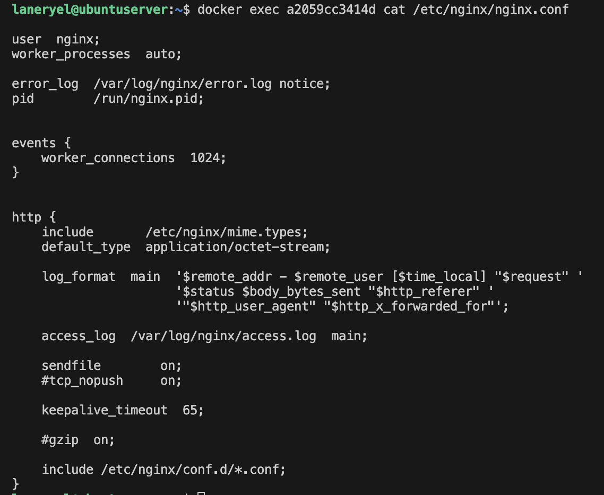
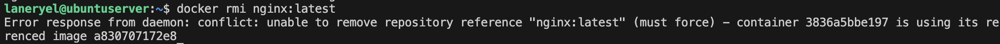
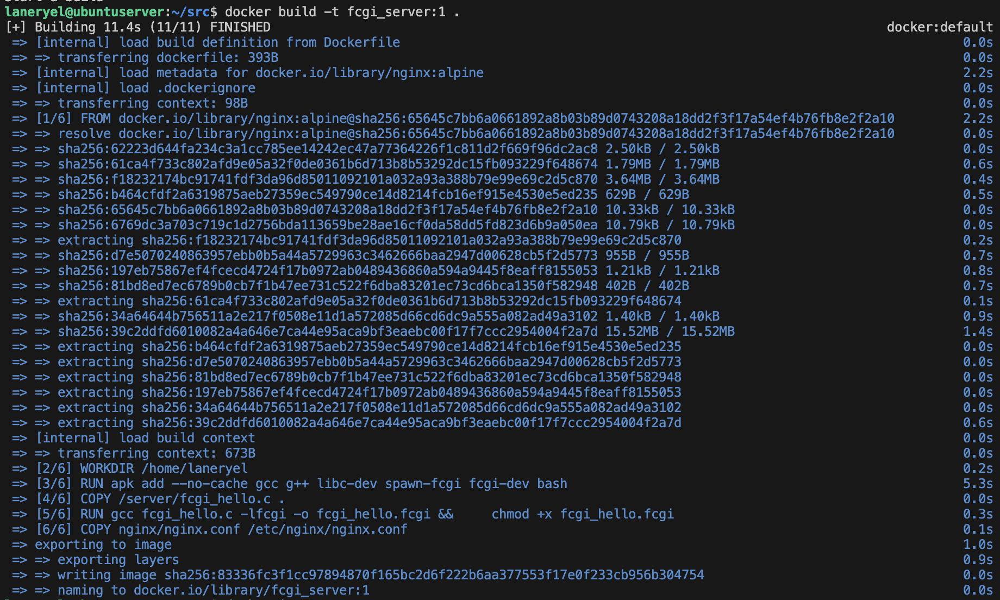

## Part 1. Готовый докер

- Скачиваем образ nginx версии latest

- Проверяем наличие образа

- Поднимаем контейнер nginx 

- Проверяем запущенные контейнеры

- При помощи команды `docker inspect` собираем информацию 

1) Размер - Size: 3.281kB
2) Замапленные порты - Ports: 80/tcp
3) ip контейнера - IPAddress: 172.17.0.2

- Останавливаем контейнер 

- Проверяем, запущен ли контейнер теперь

- Поднимаем контейнер с портами 80 и 443, замапленными на такие же порты на локальной машине и сразу же проверяем командой  `docker ps`

- Убеждаемся, что nginx доступен в браузере 

- Перезапускаем контейнер и убеждаемся, что он запущен 

## Part 2. Операции с контейнером

- Смотрим nginx.conf внутри контейнера

- Создаем на локальной машине кастомный nginx.conf и настраиваем в нем отдачу статуса по пути /status 

- Копируем созданный nginx.conf внутрь контейнера

- Перезапускаем nginx внутри контейнера

- Проверяем, что по localhost:80/status отдается страничка со статусом сервера nginx

- Экспортируем контейнер в файл container.tar и останавливаем его

- Удаляем образ, не удаляя перед этим контейнеры

Ошибка. Удалить образ, не удалив перед этим все работающие и остановленные контейнеры на основе этого образа, по умолчанию нельзя. Можно либо удалить образ, применив флаг -f, либо предварительно удалить все контейнеры. Воспользуемся вторым вариантом.

- Импортируем контейнер обратно 

- Запускаем импортированный контейнер 

- Снова проверяем, что по localhost:80/status отдается страничка со статусом сервера nginx

## Part 3. Мини веб-сервер

- Делаем мини-сервер на C и FastCgi, который будет возвращать простейшую страничку с надписью `Hello World!`

<src/screenshots/a id="1"><src/screenshots//a>

- Запускаем написанный мини-сервер через spawn-fcgi на порту 8080, предварительно скомпилировав Си-файл

<src/screenshots/a id="2"><src/screenshots//a>

- Пишем свой nginx.conf, который будет проксировать все запросы с 81 порта на 127.0.0.1:8080.

<src/screenshots/a id="3"><src/screenshots//a>

- Запускаем nginx с написанной конфигурацией 

- Смотрим, что в браузере по localhost:81 отдается написанная страничка.

- Смотрим, что файл nginx.conf лежит по пути ./nginx/nginx.conf

## Part 4. Свой докер

- Пишем докерфайл, который:
1) собирает исходники мини сервера на FastCgi из [Части 3](#1);
2) запускает его на 8080 порту, как в [Части 3](#2);
3) копирует внутрь образа написанный ./nginx/nginx.conf из [Части 3](#3);
4) запускает nginx.

<src/screenshots/a id="4"><src/screenshots//a>

- Собираем созданный докерфайл

- Проверяем через `docker src/screenshots/images` наличие образа

- Запускаем собранный докер-образ с маппингом 81 порта на 80 на локальной машине и маппингом конфигурации ./nginx/nginx.conf внутрь контейнера по адресу, где лежат конфигурационные файлы nginx

 
- Смотрим, что по адресу http://localhost:80 отдается страничка написанного сервера

- Дописываем в ./nginx/nginx.conf проксирование странички /status, по которой nginx будет отдавать статус сервера

- Перезапускаем контейнер

- Смотрим, что теперь по localhost:80/status отдается страничка со статусом сервера

## Part 5. Dockle

- Прогоняем [образ из предыдущего задания](#4) через `dockle`

<src/screenshots/a id="5"><src/screenshots//a>

- Исправляем докерфайл 

- Заново собираем и запускаем

- Снова прогоняем через `dockle`

## Part 6. Базовый Docker Compose

- Пишем файл docker-compose.yml, который:

1) Поднимает докер-контейнер из [Части 5](#5).
2) Поднимает докер-контейнер с nginx, который будет проксировать все запросы с 8080 порта на 81 порт первого контейнера.
3) Маппит 8080 порт второго контейнера на 80 порт локальной машины.

- Останавливаем и удаляем все запущенные контейнеры

- Собираем и запускаем `docker-compose`

- Смотрим, что в браузере по localhost:80 отдается написанная страничка, как и ранее

